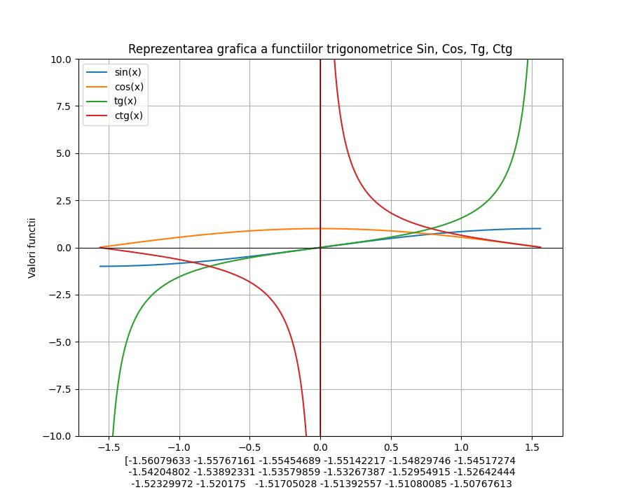

# 📐 Reprezentarea grafică a funcțiilor trigonometrice în Python

## 🎯 Descriere

Acest program în Python generează un grafic comun pentru următoarele funcții trigonometrice:

- ✅ sinus: `sin(x)`
- ✅ cosinus: `cos(x)`
- ✅ tangentă: `tan(x)`
- ✅ cotangentă: `cot(x)` definită ca `1/tan(x)`

📌 Programul trebuie să reprezinte aceste funcții în același sistem de axe, în intervalul **[-π/2, π/2]**.

📊 Pentru calcule și afișare sunt utilizate bibliotecile **NumPy** și **Matplotlib**.

## 📁 Fișiere

| Fișier              | Descriere                                      |
|---------------------|-----------------------------------------------|
| `functii_trigo.py`  | programul python care generează graficul      |
| `Grafic.jpeg`       | Graficul rezultat la rularea programului      |
| `README.md`         | Fișier de documentație                        |
| `requirements.txt`  | Listează bibliotecile necesare                |

## 📊 Vizualizare Grafic

