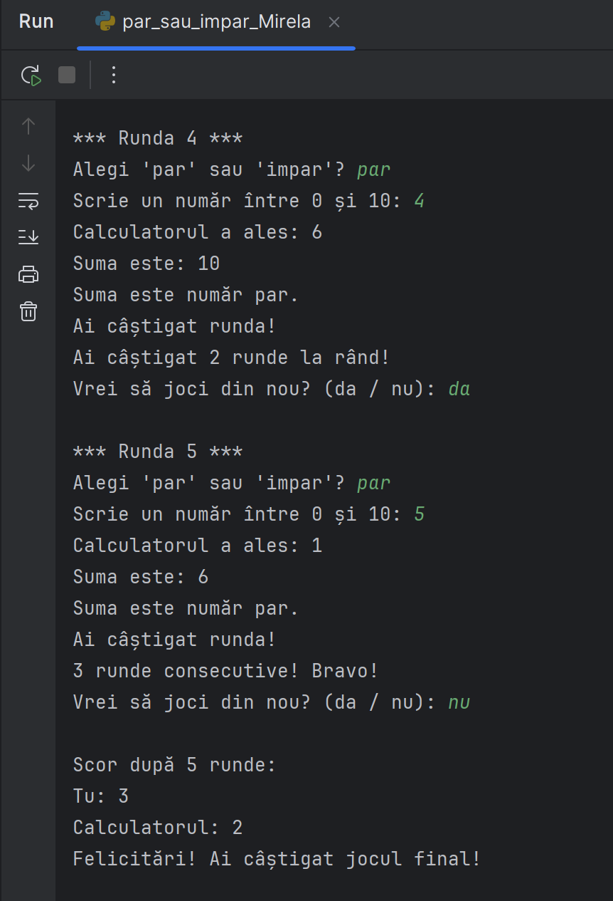

# Par sau Impar – Program în Python

Acesta este un program în Python care simulează un joc între utilizator și calculator, bazat pe ideea de par sau impar.

## Cerințe:
1. La începutul jocului, programul trebuie să întrebe utilizatorul dacă alege “par” sau “impar”.
2. Apoi, utilizatorul trebuie să introducă un număr între 0 și 10.
3. Calculatorul va alege un număr aleator între 0 și 10 (de folosit random.randint()).
4. Programul va calcula suma celor două numere.
5. Va afișa dacă suma este pară sau impară și cine a câștigat runda.
6. După fiecare rundă, programul trebuie să întrebe utilizatorul dacă dorește să joace din nou.
7. La final, programul va afișa scorul total (câte runde a câștigat utilizatorul și câte calculatorul).

## Sugestii opționale (bonus):
- Verifică dacă utilizatorul introduce un număr valid.
- Codul poate fi organizat în funcții (de exemplu: pentru alegere, verificare câștigător, afișare scor etc.).
- Afișează un mesaj diferit dacă utilizatorul câștigă de mai multe ori consecutiv.

## Exemplu din execuția programului

